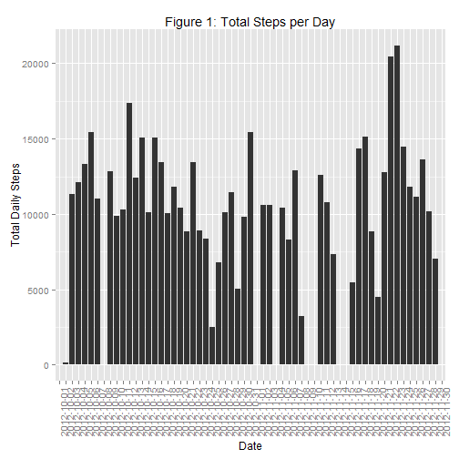
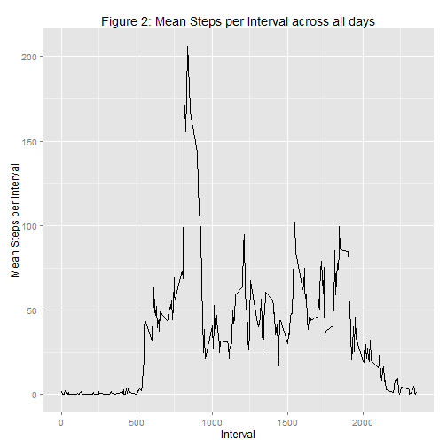
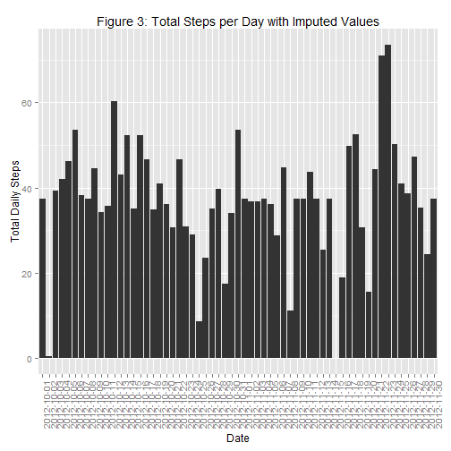
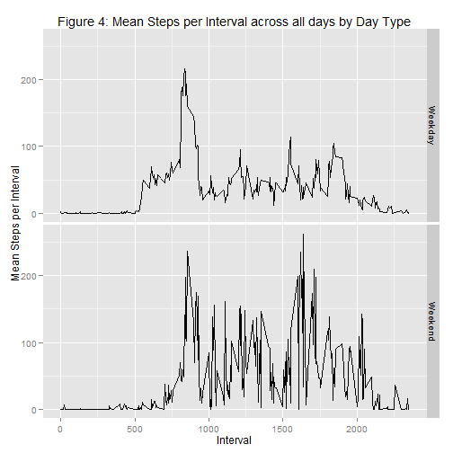

###Set up the Data and Environment

Load the necessary packages,download & unzip the file, and load the data. The first histogram in the assignment is shown below.


```r
library(dplyr)
library(ggplot2)
#download.file('https://d396qusza40orc.cloudfront.net/repdata%2Fdata%2Factivity.zip','activity.zip')
unzip('activity.zip')
a <- read.csv('activity.csv',header = T)
```

###What is mean total number of steps taken per day?

Create a histogram to answer the question.


```r
byday <- select(a,steps,date) %>%
  group_by(date) %>%
  summarise(Total = sum(steps,na.rm = T))
a.hist <- ggplot(byday,aes(date,Total)) + geom_histogram(stat = 'identity') +
 labs(title = 'Figure 1: Total Steps per Day',x = 'Date',y = 'Total Daily Steps') +
  theme(axis.text.x  = element_text(angle=90))
a.hist
```

 

Find the mean and median total steps per day.


```r
mean(byday$Total,na.rm = T)
```

```
## [1] 9354
```

```r
median(byday$Total,na.rm = T)
```

```
## [1] 10395
```


###What is the average daily activity pattern?

Create a time series plot to answer the question.


```r
byinterval<- select(a,steps,interval) %>%
  group_by(interval) %>%
  summarise(Mean = mean(steps,na.rm = T))

ts <- ggplot(byinterval,aes(interval,Mean)) + geom_line() +
  labs(title = 'Figure 2: Mean Steps per Interval across all days',
      x = 'Interval', y = 'Mean Steps per Interval')
ts
```

 

Determine the exact interval with the maximum steps per day.


```r
byinterval[byinterval$Mean == max(byinterval$Mean,na.rm = T),'interval']
```

```
## [1] 835
```

###Imputing missing values

There were a number of missing values that could bias the data. The following imputation strategy
was implemented:

Find the mean steps for each interval.


```r
impute <- select(a,steps,interval) %>%
  group_by(interval) %>%
  summarise(mean.interval = mean(steps,na.rm = T))
```

Replace missing values with the interval mean using the interval as the index.


```r
new.a <- merge(a,impute,by = 'interval')
new.a <- mutate(new.a,stepswimp = ifelse(is.na(steps),mean.interval,steps))
```

Recreate Figure 1 and mean/median for the each day.


```r
byday.new <- select(new.a,stepswimp,date) %>%
  group_by(date) %>%
  summarise(Total = mean(stepswimp,na.rm = T))
new.hist <- ggplot(byday.new,aes(date,Total)) + geom_histogram(stat = 'identity') +
  labs(title = 'Figure 3: Total Steps per Day with Imputed Values',x = 'Date',y = 'Total Daily Steps') +
  theme(axis.text.x  = element_text(angle=90))  
new.hist
```

 

```r
mean(byday.new$Total,na.rm = T)
```

```
## [1] 37.38
```

```r
median(byday.new$Total,na.rm = T)
```

```
## [1] 37.38
```

###Are there differences in activity patterns between weekdays and weekends?

Add the Day Type levels (Weekend,Weekday).


```r
new.a <- mutate(new.a,Day.Type = ifelse(weekdays(as.Date(date)) == c('Saturday','Sunday'),'Weekend','Weekday'))
```

Create a time series plot with facets by Day Type.


```r
byinterval.new <- select(new.a,steps,interval,Day.Type) %>%
  group_by(interval,Day.Type) %>%
  summarise(Mean = mean(steps,na.rm = T))

ts.new <- ggplot(byinterval.new,aes(interval,Mean)) + geom_line() +
  labs(title = 'Figure 4: Mean Steps per Interval across all days by Day Type',
       x = 'Interval', y = 'Mean Steps per Interval') + facet_grid(Day.Type ~.)
ts.new
```

 
